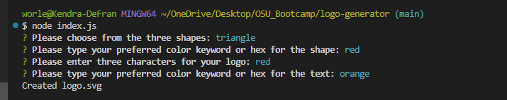
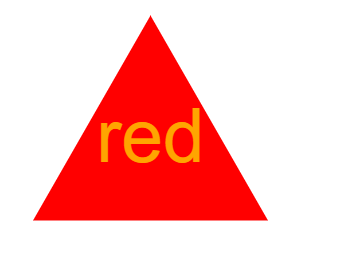

# Logo-Generator

## Description

Provide a short description explaining the what, why, and how of your project. Use the following questions as a guide:

- To create my own logo wihtout having to pay for a graphic designer, I designed an application that takes three characters, a shape and a color for the text as well as the shape to create a logo in svg format.

## Table of Contents (Optional)

- [Installation](#installation)
- [Usage](#usage)
- [License](#license)

## Installation

Having downloaded to a local folder, install inquirer and jest in the command line. 

## Usage

Here is an example of how to use the command line to input your selections:

The following image is an example of an expected output:

Attached is a link of a walkthrough for the entire application:

https://drive.google.com/file/d/1ly4UZ5O8fboZCZkPQVnRLDgQdHRJJa7r/view?usp=sharing

## License

MIT License

## Tests

Unit tests were incorporated in the construction of the application. 